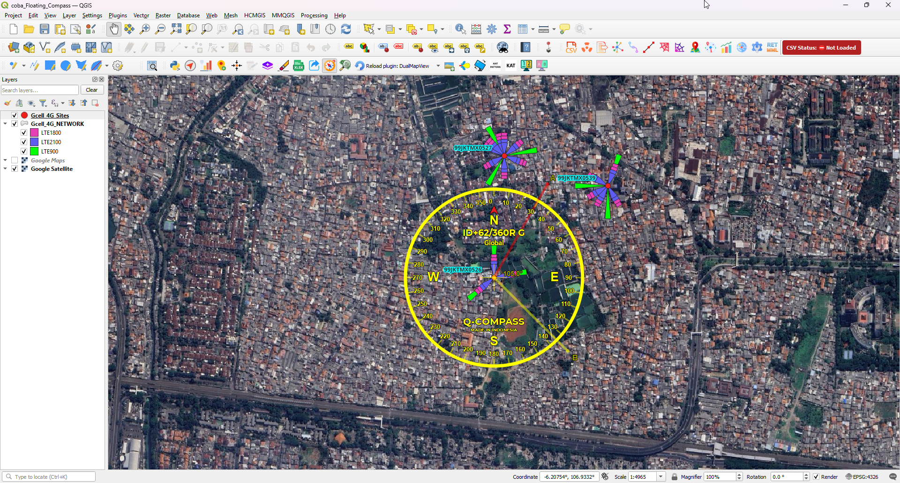
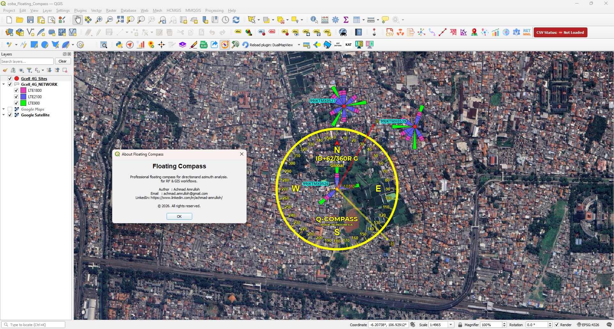

# Floating Compass – QGIS Plugin

Professional compass overlay tool for RF planning and network optimization workflows.

## 🚀 Key Features

- Floating compass overlay
- Snap to Feature precision mode
- Custom SVG-based UI skins
- Smooth drag & rotation engine
- Optimized rendering performance

## 🎯 Use Case

Designed for:
- RF Planning
- Azimuth validation
- Network optimization workflows

## 📸 Preview

## 🎥 Demo

## 📌 Note

Source code is private.  
Available upon request for collaboration or professional discussion.
-------------------------------------------------------------------
Developed as part of advanced QGIS plugin engineering practice focused on RF planning and telecom network optimization.
